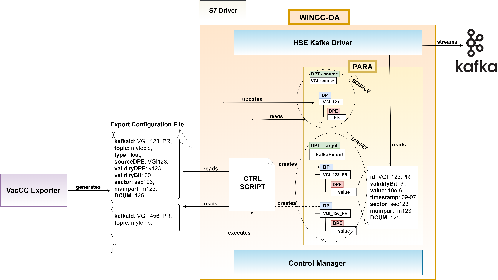

### Architecture

This section explains each of the software components of the pipeline, so that we can have a global overview of each component, and how these interact with each other.

Next, we show an image of the architecture as a whole:



#### VacCC Exporter

It is in charge of generating the configuration file.

#### Configuration file

This file is used by the WinCC-OA CTRL script to configure the streaming. Stores information about each vacuum source DPE and destination in Kafka (id and topic).

#### WinCC-OA CTRL script (vcsKafkaExport.ctl)

The implementation of this script can be considered the most critical one from all the architecture. A good design and implementation of it will determine the performance of the whole infrastructure, since it is actually the part in charge of streaming messages to Kafka.

As the title of this subsection describes, the main objective of this part of the pipeline is making use of a WinCC-OA CTRL script, which, thanks to the already implemented Kafka driver, will allow us sending the vacuum data to the different Kafka topics.

1.	It reads the configuration file that is generated by machine DBEditor Exporter. This configuration file contains information (id, value, sector, mainpart, and potentially other data) about each one of the source DPEs that are going to be streamed.

2.	For each source DPE on the configuration file:
	* It creates a different target DP from the same DPT ```_kafkaExport``` (you can check the specifications in ```lhcVacDpTypes.dpl``` file). That DPT contains one special DPE of type String. Each created DP will consequently inherit that DPE, which will allow to stream the message in JSON format. The convention followed for naming each target DP is based on its source DPE name. For example, if source DP is "VGI_1025_5l4_B.PR", the target DPE would be "VGI_1025_5l4_B_PR".
	* It creates and configures a periphery address for each target DPE, so that the driver knows to which Kafka topic the message should be sent.

3.	The script executes a dpConnect(). Its associated callback function will encode the message to be sent in JSON, based on the new value of the source DPE, and writes it to the target DPE or type ```_kafkaExport``` defined in the configuration file. The HSE driver will then automatically ensure that the value written to this target DPE reaches Kafka

#### Kafka HSE Driver

Implemented by the HSE group, it is a WinCC-OA specific driver used to stream and/or ingest data via Kafka. This component will be integrated into the WinCC-OA tool through a manager. The driver is in charge of reading the data from a target DPE, configuring its periphery address and streaming the JSON message to the corresponding Kafka topic.

#### Kafka

As stated in the introduction of this guide, it is a distributed platform for streaming data in real-time. Streamed values from WinCC-OA are stored in “topics” inside Kafka. Consumers subscribe to topics, where they can process the data to gain insights, or send them to other tools from where we can visualize and extract meaningful conclusions.
