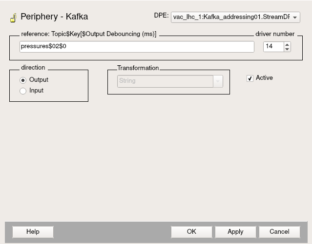
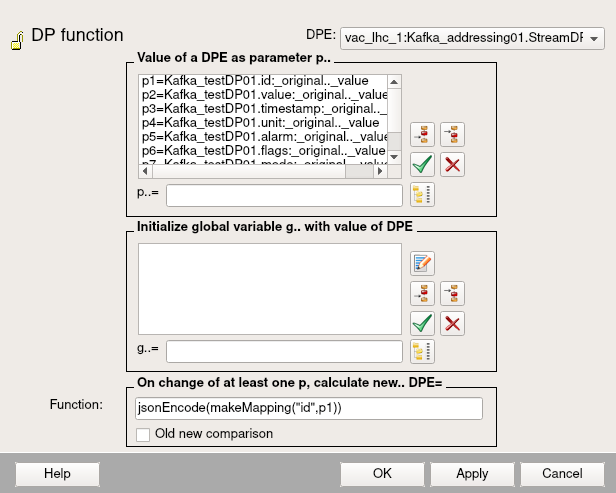
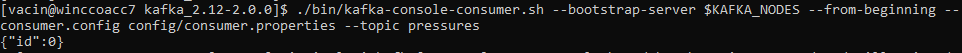

### Validating the installation

Go to ```/home/<user>/WCCOAkafkaDrv/winccoa/dplist``` and copy the file ```kafka_driver_config.dpl``` to your project's dplist folder, for instance: ```/home/<user>/PVSS_projects/vac_lhc_1/vac_lhc_1/dplist```

If the previous steps have been followed, you should be able to start your WCCOAkafkaDrv manager without problems. However, we need now to add to the driver manager the configuration file we created before (file ```config.kafka```). Open the manager properties and type:

```-num 14 +config config.kafka```

At this point, your manager should turn into green colour when starting it, and your Kafka consumer should be waiting for incoming messages. Hence, you just need to open PARA and create a DP with a DPE inside (of type String, important).

Then, you need to insert a periphery address as configuration to that created DPE, select "KAFKA Driver" and type in your address in the reference box with the format **TOPIC$KEY$DEBOUNCING**, where:

- **TOPIC**: Kafka topic (see previous section on how to create a topic)

- **KEY**: an identifier that will allow us to stream messages from the same DP into the same partition in Kafka

- **DEBOUNCING**: the time the driver will wait until sending a new batch of messages (in this case, since the value is 0, anytime the driver detects a new message, it will stream it straight forward). The DEBOUNCING parameter is 0 by default



Set 14 as the driver number and select the "Active" checkbox. Click on "Apply".

Afterwards, you need to insert a DP function into your DPE (select "DPE Connection"). In this way, the driver will read the DPE data and will convert it into JSON (this is the format in which the consumer will receive the messages). You just need to load the values you want to stream into p1, p2, …, pn parameters and use them below in the “Function” box as desired. Take a look at the following figure to understand it better (in this case, we have just encoded one single value into JSON):



After clicking in “Apply” button, we should be able to see in our Kafka consumer console (which should be running as stated before), the returned value of the DP function, in this case, the JSON ```{"id": 0}```:

