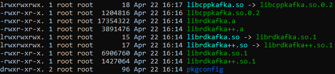

### How to compile the Kafka driver binary

As an output to this section, we will obtain a folder with all the dependencies required to run the HSE Kafka Driver. This includes the HSE Driver Kafka binary, together with the libraries that the driver is linked against, ```librdkafka``` and ```cppkafka```.

Follow the next steps:

- Clone the HSE Kafka repository in your ```/home/<user>``` folder:

	- ``` export LANGUAGE=en_US.UTF-8```
	- ``` export LANG=en_US.UTF-8```
	- ``` export LC_ALL=en_US.UTF-8```
	- ``` git clone --recurse-submodules https://github.com/cern-hse-computing/WCCOAkafkaDrv.git```


- On the ```WCCOAkafkaDrv/winccoa/bin``` folder, you will find a compiled binary for CC7. The file is called ```WCCOAkafkaDrv```.

- Create a new directory in your ```/home/<user>```. As stated before, we will include there the driver binary and the dependencies:

	- ``` sudo mkdir compilation```

- Copy the binary file ```WCCOAkafkaDrv``` from ```WCCOAkafkaDrv/winccoa/bin``` to ```/home/<user>/compilation```.


The HSE Kafka driver depends on two external libraries, ```librdkafka``` and ```cppkafka```, that we need to compile and distribute with it (using the g++ compiler). But to achieve that, we need to execute some previous commands. The following commands were extracted from HSE Kafka driver Makefile, that you can find in [CERN-HSE Computing]( https://github.com/cern-hse-computing/WCCOAkafkaDrv/blob/master/Makefile):

```
sudo yum install --assumeyes cyrus-sasl-gssapi boost* cmake openssl-devel
sudo yum install cyrus-sasl-devel.x86_64
sudo yum install gcc-c++
```

With all the pre-requirements installed, we can now compile the dependencies. On the ```/WCCOAkafkaDrv``` folder, run the following:

```cd ./libs/librdkafka && ./configure && make && sudo make install```

Go again to ```/WCCOAkafkaDrv``` folder and run the following:

```cd ./libs/cppkafka && mkdir -p build && cd build && cmake .. && make && sudo make install```

At this point, you should have all your compiled library files into ```/usr/local/lib``` folder. These files are:

- libcppkafka.so -> libcppkafka.so.0.2
- libcppkafka.so.0.2
- librdkafka.a
- librdkafka++.a
- librdkafka.so -> librdkafka.so.1
- librdkafka++.so -> librdkafka++.so.1
- librdkafka.so.1
- librdkafka++.so.1
- pkgconfig

Which you can see in the following picture:



- Copy ONLY the following files from the list above to your new compilation folder (```/home/<user>/compilation```):

- libcppkafka.so.0.2
- librdkafka.so.1


If everything went as expected, you should have in your compilation folder: two files regarding the dependencies plus the driver binary file.