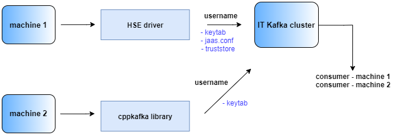

### Security configurations for accessing CERN Kafka Cluster

Security configurations are needed so that the WinCC-OA Kafka driver can communicate with the CERN Kafka cluster. With these security configurations, we will be able to launch Kafka producers or consumers.

We have made use of the Kafka General Purpose Technical Network cluster (GPTN) provided by [CERN IT department](http://nile-user-guide.web.cern.ch/nile-user-guide/kafka/general-purpose/summary.html).

The Kafka cluster handles access to producers and consumers using Kerberos and SSL authentication. For this reason, the WinCC-OA server where your project runs, needs to contain these configurations. We will next explain how to configure the cluster access and afterwards, we will show a demo on how we can use it, for example, by consuming data that has been sent from WinCC-OA to Kafka.

We need to generate a ```keytab``` file. This file contains pairs of Kerberos principals and an encrypted copy of that principal's key. Go to ```/home/<user>``` and create a directory named ```kafka```:

``` mkdir kafka```
``` cd kafka ```
``` sudo chmod 777 kafka/```
``` sudo yum install java-1.8.0-openjdk```

Follow the next steps to generate it (better use a service account, not your primary one):

```
 ktutil
 ktutil: add_entry -password -p <your_username>@CERN.CH -k 1 -e arcfour-hmac-md5
```

It will ask you for the password associated to that username.

Next, run the following, replacing <filename> by the name you desire:

``` 
 ktutil: write_kt <filename>.keytab
 ktutil: quit
 ktutil
 ktutil: read_kt <filename>.keytab
 ktutil: list
```

As a result, you should get something like:

```
slot KVNO Principal
---- ---- -------------------------------------------------------------
1 1 <your_username>@CERN.CH
```

``` ktutil: quit```


For testing if our keytab works, we will use the kinit command, which obtains or renews a Kerberos ticket. If everything is correct, ```klist``` will show the active Kerberos tickets, as we show in the example below.

```
 kinit -kt <filename>.keytab <your_username>
 klist
```

```
Ticket cache: FILE:/tmp/krb5cc_0 slot KVNO Principal
Default principal: <your_username>@CERN.CH

Valid starting     Expires            Service principal
01/21/20 16:58:59  01/22/20 17:58:59  krbtgt/CERN.CH@CERN.CH
renew until 01/26/20 16:58:59
```

Check that your keytab file was created at ```/home/<user>/kafka``` folder.
 
Create a configuration file named ```jaas.conf``` at ```/home/<user>/kafka``` level and write the following content, replacing the keytab default path and your principal username below:

		KafkaClient {
		  com.sun.security.auth.module.Krb5LoginModule required
		  useKeyTab=true
		  storeKey=true
		  keyTab="/path/to/your/keytab_file"
		  principal="<your_username>@CERN.CH";
		};

		// Zookeeper client authentication, still needed for some actions and tools.
		// e.g. list the topics with kafka-topics.sh
		Client {
		  com.sun.security.auth.module.Krb5LoginModule required
		  useKeyTab=true
		  storeKey=true
		  keyTab="/path/to/your/keytab_file"
		  principal="<your_username>@CERN.CH";
		};

If when generated that file, it has root ownership, change the ownership of that file to your username.
 
Now, we will need to generate the truststore file (.jks) in ```/home/<user>/kafka```. This file contains the CERN's CA certificates, which is needed to access the cluster in a secure mode. To do so, execute the following commands replacing the corresponding fields (truststore name and password):
```
 curl https://cafiles.cern.ch/cafiles/certificates/CERN%20Root%20Certification%20Authority%202.crt -o CERNRootCertificationAuthority2.crt
```
```
 curl https://cafiles.cern.ch/cafiles/certificates/CERN%20Grid%20Certification%20Authority.crt -o CERNGridCertificationAuthority.crt
```
```
 keytool -importcert -file CERNRootCertificationAuthority2.crt -keystore <filename>.jks -alias "cernroot" -storepass <changeit> -noprompt
```
```
 keytool -importcert -file CERNGridCertificationAuthority.crt -keystore <filename>.jks -alias "cerngrid" -storepass <changeit> -noprompt
```

If everything went well, you should be able to see how a new .jks file has been automatically generated. In total, we should have created the keytab file, the jaas.conf file and the truststore file. Here we show a picture to clarify:


On ```/opt/WinCC_OA/3.16/config``` folder, create a file named ```config.kafka```. This file contains information about Kafka clients configuration. In our case, we will configure both a producer and a consumer. Paste the following piece of code into such file and replace the **[USERNAME]** and the **[PROJECT_PATH]** with your own information:

	[kafka]
	PRODUCER.CONFIG.metadata.broker.list = dbnile-kafka-a-8.cern.ch:9093,dbnile-kafka-b-8.cern.ch:9093,dbnile-kafka-c-8.cern.ch:9093
	PRODUCER.CONFIG.security.protocol = SASL_SSL
	PRODUCER.CONFIG.sasl.mechanism = GSSAPI
	PRODUCER.CONFIG.sasl.kerberos.service.name = kafka
	PRODUCER.CONFIG.sasl.kerberos.principal = [USERNAME]
	PRODUCER.CONFIG.sasl.kerberos.keytab = [PROJECT_PATH]/config/<your_keytab>.keytab
	PRODUCER.CONFIG.group.id = test-producer-group
	PRODUCER.CONFIG.statistics.interval.ms = 60000
	CONSUMER.CONFIG.metadata.broker.list = dbnile-kafka-a-8.cern.ch:9093,dbnile-kafka-b-8.cern.ch:9093,dbnile-kafka-c-8.cern.ch:9093
	CONSUMER.CONFIG.security.protocol = SASL_SSL
	CONSUMER.CONFIG.sasl.mechanism = GSSAPI
	CONSUMER.CONFIG.sasl.kerberos.service.name = kafka
	CONSUMER.CONFIG.sasl.kerberos.principal = [USERNAME]
	CONSUMER.CONFIG.sasl.kerberos.keytab = [PROJECT_PATH]/config/<your_keytab>.keytab
	CONSUMER.CONFIG.statistics.interval.ms = 60000
	CONSUMER.CONFIG.group.id = test-consumer-group
	CONSUMER.CONFIG.enable.auto.commit = true

Just after this, you need to make a copy of your keytab file into your project's config directory. After copied, change its ownership to your username.

To finish the configuration part, you will need to export the following environment variables, replacing the needed parameters:
```
 export KAFKA_OPTS="-Djavax.net.ssl.trustStore=/path/to/your/truststore_file -Djava.security.auth.login.config=/path/to/your/jaas_file"
 export KAFKA_NODES="dbnile-kafka-a-8.cern.ch:9093,dbnile-kafka-b-8.cern.ch:9093,dbnile-kafka-c-8.cern.ch:9093"
 export KAFKA_HEAP_OPTS="-Xms512m -Xmx1g"
```

Notice that once you have followed all these steps for a specific account, you don't need to repeat them again if you want to get access to the Kafka cluster from another machine: you will only need to create a new keytab file with the steps already explained. See the following drawing:

