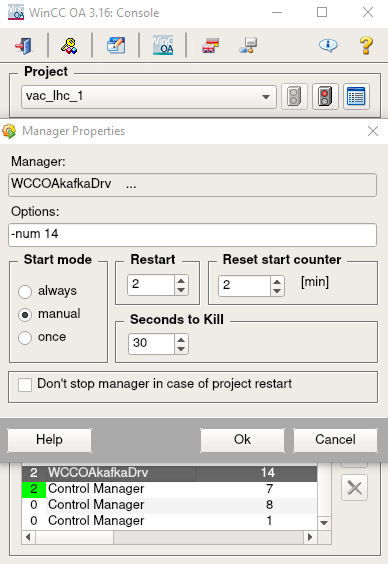

### How to run the Kafka Driver on WinCC-OA

In order for this infrastructure to work, a CC7 machine with WinCC-OA is required. The HSE driver is compiled against WinCC-OA 3.16 API libraries, and therefore it will only work on WinCC-OA 3.16. We assume here that you already have installed WinCC-OA 3.16 in your CC7 machine version [RPM main] from [WinCC-OA Download](https://readthedocs.web.cern.ch/display/ICKB/WinCCOA+Service+Download+3.16), as well as created a WinCC-OA project, to which we will add the driver.

Next, we will explain the steps to follow for configuring and running the Kafka driver in WinCC-OA:

- Export the environment variable ```LD_LIBRARY_PATH```, pointing to your project's bin folder. This variable tells the operating system where it should look for the already compiled libraries. For instance:

	``` export LD_LIBRARY_PATH=/home/vacin/PVSS_projects/vac_lhc_1/vac_lhc_1/bin```

- Copy the content of the compilation folder ```/home/<user>/compilation```, generated in [Data Pipeline Compilation](compilation.md), to your project's bin directory. Change the ownership to your username for all of those files.

- Execute ```sudo ldconfig``` for updating the necessary library links.

- Create a new WCCOAkafkaDrv manager, with ```-num 14```. If you didn't have problems up to this point, you should be able to start your manager:

