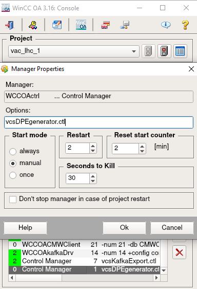
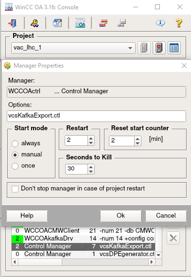

### Streaming Test

We will explain how to make use of the WinCC-OA CTRL script to test our pipeline. At this point, we assume you were able to start your WCCOAkafkaDrv manager, so leave it running.

Then, follow the next steps:

- Add a new WinCC-OA Control Manager into your project, setting as parameter an auxiliary CTRL script, ```vcsDPEgenerator.ctl```. You can find this file here: G:\Departments\TE\Groups\VSC\ICM\Users\LUNA\SCADA Data Pipeline. In that script, change "<your_topic_name>" by the name you gave to the topic you already created. Place file ```vcsDPEgenerator.ctl``` into your project's scripts folder.



- Start the Control Manager from previous step. It will launch the ```vcsDPEgenerator.ctl``` file, which will automatically generate a Kafka export configuration file in JSON format.

- Create a new WinCC-OA Control Manager that takes as parameter the name of the CTRL script, ```vcsKafkaExport.ctl``` (you can find this file in the LHC project in WinCC-OA scripts folder, under ```nerea_branch``` branch).



- Start a Kafka consumer (if you didn’t do it before)

- Start now the WinCC-OA Control Manager that takes as input the ```vcsKafkaExport.ctl``` script, and take a look at your consumer console(s). If no messages appear there, this implies your Kafka buffer was empty and didn’t have anything to process. In that case, go to PARA and change the value from any source DPE (choose one that is included in your configuration file). When clicking on “Apply”, you should see that the message appears in your consumer terminal.